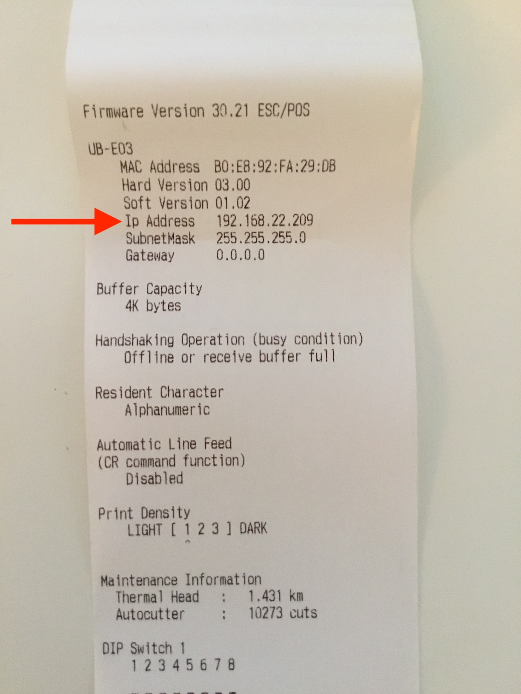
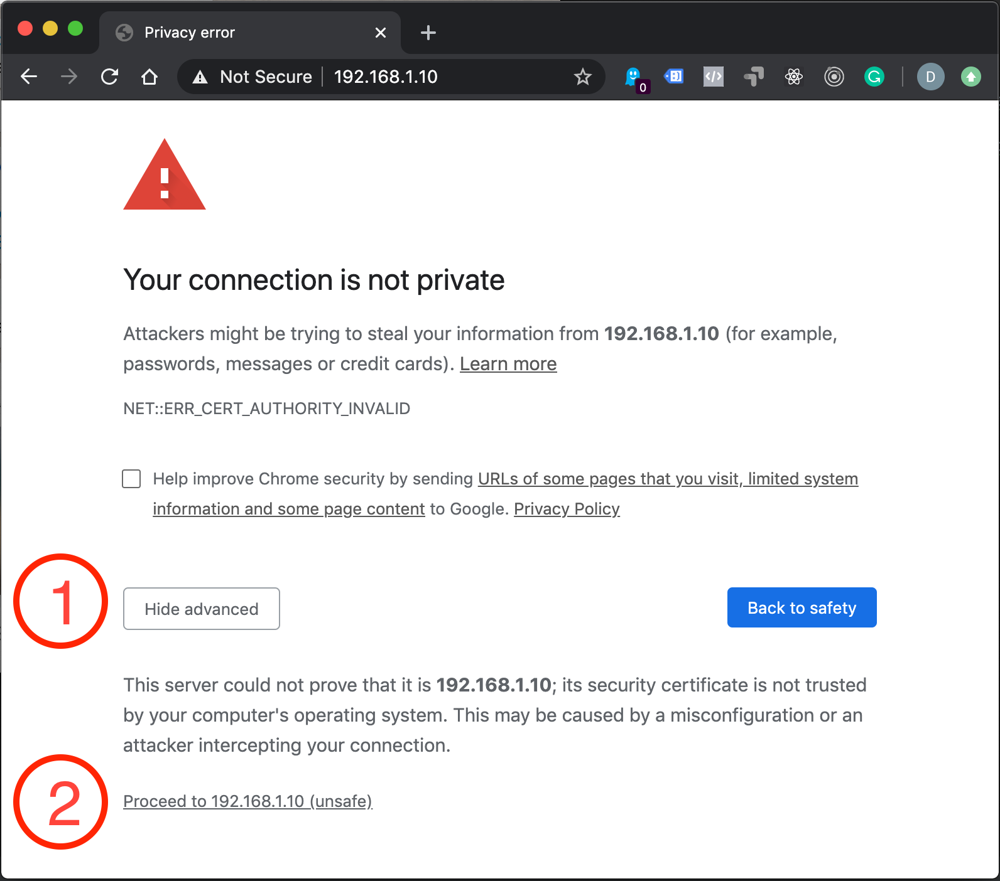
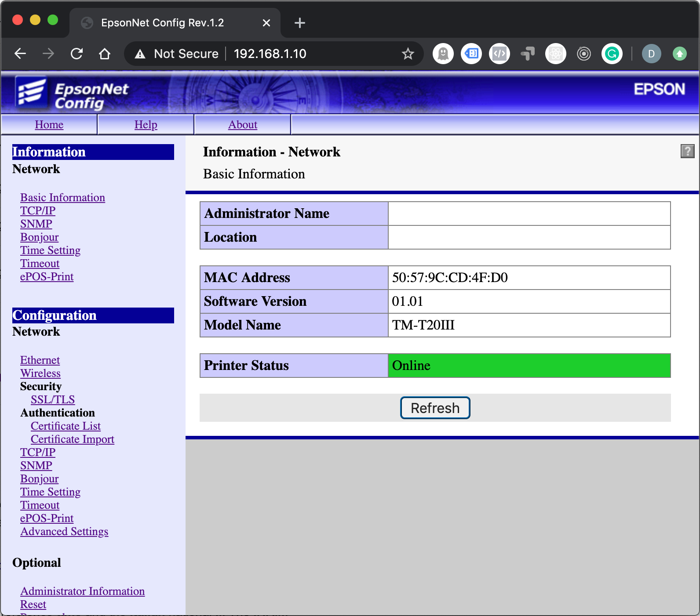
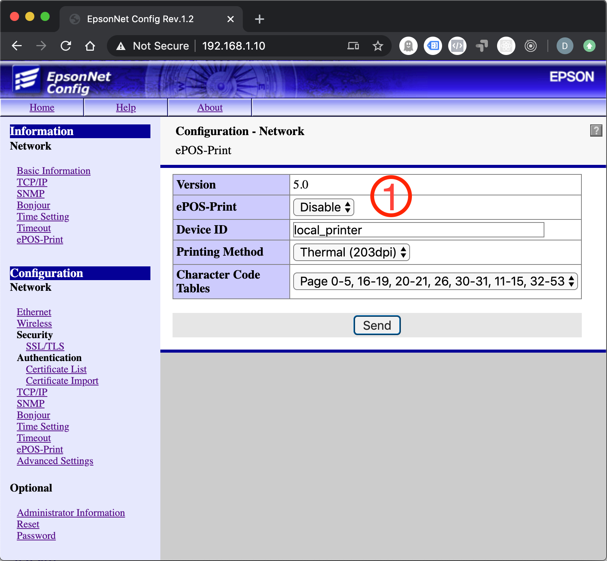
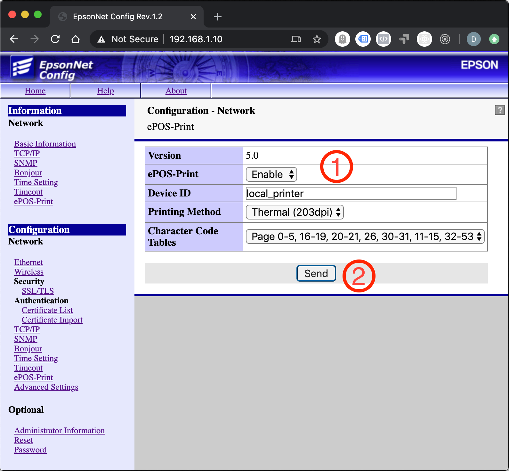
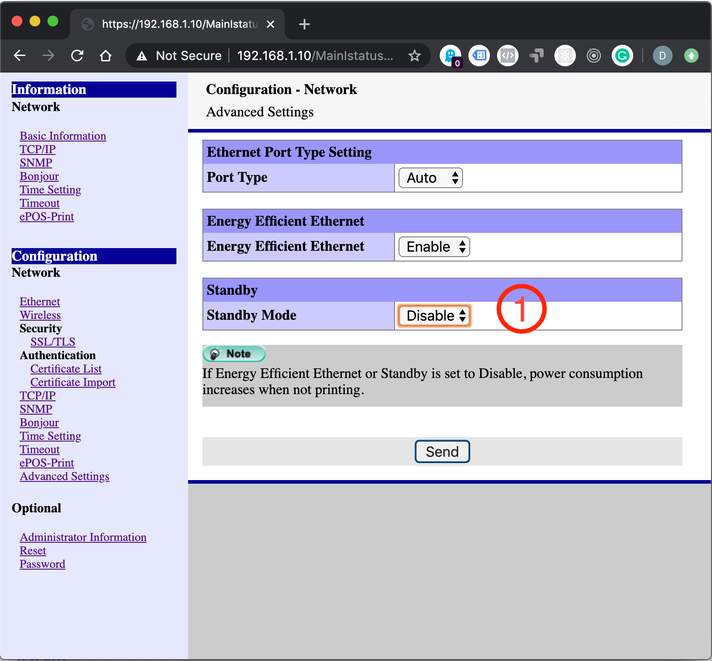

# Preparazione di una nuova stampante per Deliverart

Per poter stampare con Deliverart bisogna abilitare alcune funzionalità della stampante.

## IP della stampante

La prima cosa da fare è cercare l'IP della stampante, supponiamo che l'IP sia **192.168.1.10**.
Fatta questa operazione, possiamo collegarci tramite un browser, ad esempio Chrome, all'indirizzo IP della stampante come segue: [https://192.168.1.10/](https://192.168.1.10/).

Nel caso non sapessi qual'è l'indirizzo IP, è anche possibile stampare un documento che riporta tutti i dati della stampante.
Basta seguire dei semplici passi:
1. Spegnere la stampante
2. Tenere premuto il pulsante FEED (cioè quello che fa uscire la carta)
3. Mentre si tiene premuto il pulsante di FEED, accendere la stampante
4. Dopo qualche secondo uscirà un foglio di carta con diversi dati stampati tra cui l'indirizzo IP ed il MAC Address.

## Certificato

La stampante ha un certificato di sicurezza interno che non viene riconosciuto dal browser, questo significa che dobbiamo prima accettarlo per poter contunuare.

Le operazione da fare sono:

- Cliccare su Avanzate (1 nel cerchio rosso)
- Cliccare su procedi su 192.168.1.10 (2 sul cerchio rosso)

## Accedere alla configurazione

Una volta accettato il certificato la stampante ci chiederà le credenziali di accesso.

Utilizzare quelle di default di Epson:

- Username: epson
- Password: epson

Una volta entrati avrete un pannello di controllo con questa interfaccia:

Sulla sinistra ci sono due menu, in alto la parte informativa: **Information**, più in basso, la parte delle impostazioni: **Configuration**.

A questo punto dobbiamo completare due settaggi, il primo è abilitare le API della stampante, il secondo è disabilitare lo Stand by mode della stessa.

## Abilitare le API della stampante

Dal menu di sinistra, sotto la voce in basso **Configuration** cliccare su **ePOS-Print**, comparirà una schermata come questa sotto.

Modificare il valore di ePOS-Print *(1 nel cerchio rosso)* da **Disable** a **Enable**, vedi figura sotto:

Cliccare ora su **Send** *(2 nel cerchio rosso)*. Comparirà una schermata come la seguente:

Cliccare ora su **Reset**. Comparirà una schermata come la seguente, attendi un minuto circa:

Una volta finito comparirà la schermata di esito come quella in basso, cliccare su **Go Home**

## Disabilitare lo Stand by Mode

Dal menu di sinistra, sotto la voce in basso **Configuration** cliccare su **Advanced Settings**, si aprirà questa schermata.

Modificare la voce **Standby Mode** da **Enable** a **Disable** (1 nel cerchio rosso), cliccare poi su **Send** e comparirà una schermata come le precendenti:

Cliccare ora su **Reset**. Comparirà una schermata come la seguente, attendi un minuto circa:

Una volta finito comparirà la schermata di esito come quella in basso, cliccare su **Go Home**

Abbiamo, finito, puoi chiudere la finestra del browser e iniziare a stampare scontrini con Deliverart.

Grazie
